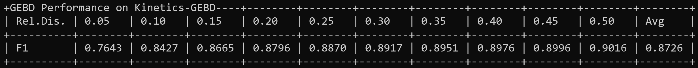

# DDM-Net (CVPR 2022)

This repo holds the codes of paper: "[Progressive Attention on Multi-Level Dense Difference Maps for Generic Event Boundary Detection](https://arxiv.org/abs/2112.04771)", accepted in CVPR 2022.


## News
[2022.5.8] The code is available now.  
[2022.3.3] DDM-Net is accepted to CVPR 2022.  
[2021.11.16] Our DDM-Net ranks 1st on the leaderboard of [LOVEU@CVPR 2021](https://competitions.codalab.org/competitions/30452#results), outperforming the top1 solution of LOVEU Challenge 2021.


## Overview
This paper presents a modular framework for the task of generic event boundary detection (GEBD). To perceive diverse temporal variations and learn complex semantics of generic event boundaries, our method progressively attends to multi-level dense difference maps (DDM). Thanks to holistic temporal modeling and joint feature learning across modalities, our DDM-Net outperforms the previous state-of-the-art methods by a large margin on Kinetics-GEBD and TAPOS benchmark. In addition, our method is better than winner solutions of LOVEU Challenge@CVPR 2021, further demonstrating the efficacy of DDM-Net.


## Dependencies
Python 3.7 or higher  
PyTorch 1.6 or higher  
einops  
ipdb

## Guide
Please refer to [GUIDE](GUIDE.md) for preparing input data and generating boundary predictions.


## Performance
Dataset  | F1@0.05 | F1@0.25 | F1@0.5 | Avg F1 | checkpoint | pickle
:--: | :--: | :--: | :--:|  :--:| :--: | :--:
Kinetics-GEBD | 76.43% | 88.70% | 90.16% | 87.26% | [ckpt](https://drive.google.com/file/d/1k66v9VuFgah3Wx6eKmWpj8_b5MXxlwt7/view?usp=sharing) | [pkl](https://drive.google.com/file/d/1opjGA4eC5-IBHehMOSkXcY1MFEUAJNPG/view?usp=sharing)




## Training

Use `tools/train.sh` to train DDM-Net.

```
python DDM-Net/train.py \
--dataset kinetics_multiframes \
--train-split train \
--val-split val \
--num-classes 2 \
--batch-size 16 \
--n-sample-classes 2 \
--n-samples 16 \
--lr 0.00001 \
--warmup-epochs 0 \
--epochs 5 \
--decay-epochs 2 \
--model multiframes_resnet \
--pin-memory \
--sync-bn \
--amp \
--native-amp \
--distributed \
--eval-metric loss \
--log-interval 50 \
--port 16580 \
--eval-freq 1
```


## Testing

Inference with `tools/test.sh`.

```
python DDM-Net/test.py \
--dataset kinetics_multiframes \
--val-split val \
-b 128 \
--resume checkpoint.pth.tar
```


## Citation
If you find DDM-Net useful in your research, please cite us using the following entry:
```
@InProceedings{Tang_2022_CVPR,
    author    = {Tang, Jiaqi and Liu, Zhaoyang and Qian, Chen and Wu, Wayne and Wang, Limin},
    title     = {Progressive Attention on Multi-Level Dense Difference Maps for Generic Event Boundary Detection},
    booktitle = {Proceedings of the IEEE/CVF Conference on Computer Vision and Pattern Recognition (CVPR)},
    month     = {June},
    year      = {2022},
    pages     = {3355-3364}
}
```


## Acknowledgement
We especially thank the contributors of the [GEBD](https://github.com/StanLei52/GEBD), [RepNet](https://colab.research.google.com/github/google-research/google-research/blob/master/repnet/repnet_colab.ipynb), [TSM](https://github.com/hello-jinwoo/LOVEU-CVPR2021) and [DETR](https://github.com/facebookresearch/detr) for providing helpful code.

Thanks to [Fengyuan Shi](https://github.com/ShiFengyuan1999) and Xun Jiang for their help.

## Contact

```
Jiaqi Tang: jqtang@smail.nju.edu.cn
```
